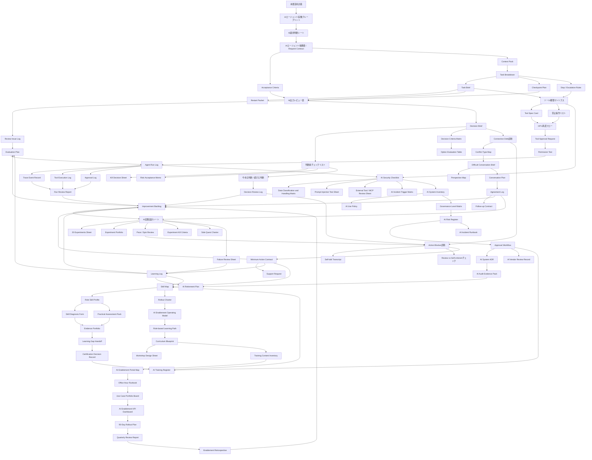

# Artifact Index: 本書で作る成果物

本書は概念理解だけを目的にしない。章ごとに、現場で使う成果物を作る。

このページでは、最初に目的別・職種別の入口を示し、その後に成果物を章領域別の短いカード一覧として整理する。横長の大表を読む必要がないよう、各成果物は「初出」「主な利用者」「用途」を分けて確認できる形にする。

## 入口

### 目的別入口（目的別索引）

- **まず使う**: [AI適用判断シート](#work-intake)、[Request Contract](#request-context)、[Context Pack](#request-context)、[AI出力レビュー表](#review-evaluation-artifacts)、[Improvement Backlog](#log-observability-artifacts)から始める。
- **レビューする**: [Acceptance Criteria](#request-context)、[AI出力レビュー表](#review-evaluation-artifacts)、[Review Issue Log](#review-evaluation-artifacts)、[Evaluation Plan](#review-evaluation-artifacts)、[Run Review Report](#log-observability-artifacts)を使う。
- **権限を設計する**: [ツール権限マトリクス](#tool-permission-artifacts)、[Tool Spec Card](#tool-permission-artifacts)、[HITL承認フロー](#tool-permission-artifacts)、[禁止操作リスト](#tool-permission-artifacts)、[Permission Test](#tool-permission-artifacts)を確認する。
- **ガバナンスする**: [AI Use Policy](#governance-artifacts)、[AI Use Case Intake](#governance-artifacts)、[AI System Inventory](#governance-artifacts)、[Governance Level Matrix](#governance-artifacts)、[AI Risk Register](#governance-artifacts)、[AI Audit Evidence Pack](#governance-artifacts)を組み合わせる。
- **研修化する**: [Skill Map](#skill-rollout-artifacts)、[Role Skill Profile](#skill-rollout-artifacts)、[Practical Assessment Pack](#skill-rollout-artifacts)、[Role-based Learning Path](#skill-rollout-artifacts)、[Curriculum Blueprint](#skill-rollout-artifacts)、[Workshop Design Sheet](#skill-rollout-artifacts)を使う。

### 職種別入口（職種別索引）

- **全社員**: [AI適用判断シート](#work-intake)、[Request Contract](#request-context)、[Context Pack](#request-context)、[AI出力レビュー表](#review-evaluation-artifacts)、[AI Security Checklist](#security-privacy-artifacts)、[AI Use Policy](#governance-artifacts)を優先する。
- **管理職**: [AIエージェント協働ブループリント](#work-intake)、[Task Brief](#delegation-artifacts)、[HITL承認フロー](#tool-permission-artifacts)、[Decision Brief](#human-decision-artifacts)、[Risk Acceptance Memo](#human-decision-artifacts)、[Run Review Report](#log-observability-artifacts)を優先する。
- **エンジニア**: [Evaluation Plan](#review-evaluation-artifacts)、[ツール権限マトリクス](#tool-permission-artifacts)、[Tool Spec Card](#tool-permission-artifacts)、[Permission Test](#tool-permission-artifacts)、[Agent Run Log](#log-observability-artifacts)、[Prompt Injection Test Sheet](#security-privacy-artifacts)を優先する。
- **AI推進担当**: [AI Use Case Intake](#governance-artifacts)、[AI System Inventory](#governance-artifacts)、[Governance Level Matrix](#governance-artifacts)、[AI Training Register](#governance-artifacts)、[Role Skill Profile](#skill-rollout-artifacts)、[90-Day Rollout Plan](#skill-rollout-artifacts)を優先する。
- **経営層**: [AI Use Policy](#governance-artifacts)、[Decision Brief](#human-decision-artifacts)、[Rollout Charter](#skill-rollout-artifacts)、[AI Enablement Operating Model](#skill-rollout-artifacts)、[AI Enablement KPI Dashboard](#skill-rollout-artifacts)、[Quarterly Review Report](#skill-rollout-artifacts)を優先する。

## 成果物一覧

各成果物は、章を読みながら必要になったものだけを作ればよい。全件を同時に作る必要はない。

### 全体入口・Work選定 {#work-intake}

- **本書活用計画 / Reading Route Plan**（初出: 第0章 / 主な利用者: 全読者）
  - 用途: 読者タイプ、対象業務、読む章、最初に作る成果物、30日以内の小実験を決める。
- **AIエージェント協働ブループリント**（初出: 第1章 / 主な利用者: 全社員、管理職）
  - 用途: 人間、業務、AIの責任境界を最初に整理する。
- **AI適用判断シート**（初出: 第2章 / 主な利用者: 全社員、管理職）
  - 用途: AIに任せる仕事を選ぶ。

### Request / Context設計 {#request-context}

- **AIエージェント依頼書 / Request Contract**（初出: 第3章 / 主な利用者: 全社員）
  - 用途: AIへの依頼を目的、成果物、制約、受け入れ条件まで含む仕様にする。
- **Acceptance Criteria**（初出: 第3章 / 主な利用者: 全社員、管理職）
  - 用途: AI出力を受け入れる条件を定義する。
- **Context Pack**（初出: 第4章 / 主な利用者: 全社員、業務担当者）
  - 用途: 前提、制約、情報鮮度、不確実性、機密区分を渡す。

### Delegation設計 {#delegation-artifacts}

- **Task Brief**（初出: 第5章 / 主な利用者: 業務担当者、管理職）
  - 用途: 個別タスクの入力、出力、受け入れ条件、停止条件を定義する。
- **Task Breakdown**（初出: 第5章 / 主な利用者: 業務担当者、管理職）
  - 用途: 複雑な業務を複数の委任可能タスクへ分解する。
- **Checkpoint Plan**（初出: 第5章 / 主な利用者: 業務担当者、管理職）
  - 用途: AIが次へ進む前に人間が確認する地点を定義する。
- **Stop / Escalation Rules**（初出: 第5章 / 主な利用者: 業務担当者、管理職、AI推進担当）
  - 用途: AIが停止する条件と、誰に渡すかを定義する。
- **Restart Packet**（初出: 第5章 / 主な利用者: 業務担当者、管理職）
  - 用途: 中断後に別セッション・別担当者が作業を再開できる状態を残す。

### Review / Evaluation {#review-evaluation-artifacts}

- **AI出力レビュー表**（初出: 第6章 / 主な利用者: 全社員、管理職）
  - 用途: AI出力を成果物として採用できるか判定する。
- **Review Issue Log**（初出: 第6章 / 主な利用者: 全社員、管理職、AI推進担当）
  - 用途: レビューで見つけた問題をSeverity付きで記録し、改善先へ接続する。
- **Evaluation Plan**（初出: 第6章 / 主な利用者: エンジニア、AI推進担当）
  - 用途: AI活用の仕組みとしての品質、回帰評価、禁止出力を評価する。

### Tool / Permission / HITL {#tool-permission-artifacts}

- **ツール権限マトリクス**（初出: 第7章 / 主な利用者: エンジニア、情シス、AI推進担当）
  - 用途: AIがどのツールでどの操作をどの条件で実行できるかを制御する。
- **Tool Spec Card**（初出: 第7章 / 主な利用者: エンジニア、AI推進担当）
  - 用途: AIが誤用しにくいツール仕様を定義する。
- **HITL承認フロー**（初出: 第7章 / 主な利用者: 管理職、AI推進担当）
  - 用途: 人間承認を業務に組み込む。
- **Tool Approval Request**（初出: 第7章 / 主な利用者: 管理職、承認者、AI推進担当）
  - 用途: AIのツール実行前に承認者へ提示する承認パケットを作る。
- **禁止操作リスト**（初出: 第7章 / 主な利用者: 管理職、情シス、セキュリティ）
  - 用途: AIに実行させない操作を明文化する。
- **Permission Test**（初出: 第7章 / 主な利用者: エンジニア、AI推進担当、セキュリティ）
  - 用途: 権限設計が実際に機能するかをテストする。

### Log / Observability / Improvement {#log-observability-artifacts}

- **Agent Run Log**（初出: 第8章 / 主な利用者: エンジニア、AI推進担当、管理職）
  - 用途: AIエージェントの1回の業務実行を、依頼、前提、出力、レビュー、承認、改善までRun単位で記録する。
- **Trace Event Record**（初出: 第8章 / 主な利用者: エンジニア、AI推進担当）
  - 用途: モデル呼び出し、検索、ツール実行、承認、エラーなどのイベントを追跡する。
- **Tool Execution Log**（初出: 第8章 / 主な利用者: エンジニア、情シス、AI推進担当）
  - 用途: AIが呼び出したツールの操作、スコープ、権限、承認、実行結果を記録する。
- **Approval Log**（初出: 第8章 / 主な利用者: 管理職、AI推進担当、監査担当）
  - 用途: HITL承認の判断内容、承認者、条件、実行内容との差分を記録する。
- **Run Review Report**（初出: 第8章 / 主な利用者: 管理職、AI推進担当）
  - 用途: 複数Runを定期的に振り返り、傾向と改善アクションを整理する。
- **Improvement Backlog**（初出: 第8章 / 主な利用者: AI推進担当、管理職、エンジニア）
  - 用途: ログ、レビュー、評価、インシデントから生じた改善項目を管理する。
- **Observability Design Sheet**（初出: 第8章 / 主な利用者: エンジニア、AI推進担当、情シス）
  - 用途: AIエージェント導入前に、ログ、トレース、保持期間、アクセス権、Run Reviewを設計する。
- **Metrics Dashboard Definition**（初出: 第8章 / 主な利用者: 管理職、AI推進担当）
  - 用途: 利用、品質、リスク、効率、学習の指標を定義する。

### Security / Privacy {#security-privacy-artifacts}

- **AI Security Checklist**（初出: 第9章 / 主な利用者: 全社員、セキュリティ）
  - 用途: AI固有リスクを確認する。
- **Data Classification and Handling Matrix**（初出: 第9章 / 主な利用者: 全社員、情シス、セキュリティ）
  - 用途: AI入力、Context Pack、RAG、ログ、評価データへの情報利用可否を決める。
- **Untrusted Input Handling Rule**（初出: 第9章 / 主な利用者: 全社員、AI推進担当）
  - 用途: 外部文書、メール、PDF、Web、RAG文書を命令ではなくデータとして扱うルールを定義する。
- **Prompt Injection Test Sheet**（初出: 第9章 / 主な利用者: エンジニア、AI推進担当、セキュリティ）
  - 用途: 外部入力内の悪意ある命令にAIが従わないことをテストする。
- **AI Privacy Impact Review**（初出: 第9章 / 主な利用者: 管理職、法務、セキュリティ）
  - 用途: 個人情報、顧客情報、従業員情報を扱うAI利用のプライバシー影響を確認する。
- **External Tool / MCP Review Sheet**（初出: 第9章 / 主な利用者: エンジニア、情シス、セキュリティ）
  - 用途: 外部ツール、MCP、プラグイン、SaaS連携のリスクを審査する。
- **Security Exception Record**（初出: 第9章 / 主な利用者: 管理職、セキュリティ、AI推進担当）
  - 用途: 通常ルールからの例外を期限付きで記録する。
- **AI Incident Trigger Matrix**（初出: 第9章 / 主な利用者: セキュリティ、AI推進担当、管理職）
  - 用途: AI利用を停止・エスカレーションする条件を定義する。

### Governance / Audit {#governance-artifacts}

- **AI Use Policy**（初出: 第10章 / 主な利用者: 経営層、AI推進担当、全社員）
  - 用途: 社内AI利用の許可、条件付き許可、要承認、禁止、インシデント時連絡先を定義する。
- **AI Use Case Intake**（初出: 第10章 / 主な利用者: 全社員、管理職、AI推進担当）
  - 用途: 新しいAI利用を始める前に、目的、データ、外部送信、ツール連携、顧客影響を整理する。
- **AI System Inventory**（初出: 第10章 / 主な利用者: AI CoE、情シス、管理職）
  - 用途: 社内AI利用をユースケース単位で台帳化し、Owner、データ、権限、リスク、統制、廃止条件を管理する。
- **Governance Level Matrix**（初出: 第10章 / 主な利用者: AI推進担当、管理職、セキュリティ）
  - 用途: AI利用をG0〜G5などの統制レベルに分類する。
- **AI Risk Register**（初出: 第10章 / 主な利用者: AI推進担当、Risk Owner）
  - 用途: AI利用に関するリスク、統制、残リスク、Owner、期限を管理する。
- **Approval Workflow**（初出: 第10章 / 主な利用者: 管理職、AI推進担当、承認者）
  - 用途: Use Case Approval、Tool Action Approval、Risk Acceptance、Exceptionの承認経路を定義する。
- **AI System ADR**（初出: 第10章 / 主な利用者: エンジニア、AI推進担当、管理職）
  - 用途: AI利用の重要な設計判断、代替案、残リスク、停止条件を記録する。
- **AI Vendor Review Record**（初出: 第10章 / 主な利用者: 情シス、法務、セキュリティ）
  - 用途: 外部AI、SaaS、MCP、ベンダーのデータ保持、認証、監査ログ、契約条件を審査する。
- **AI Training Register**（初出: 第10章 / 主な利用者: AI推進担当、管理職、人事）
  - 用途: ロール別のAIリテラシー、確認テスト、実技課題、再受講期限を管理する。
- **AI Incident Runbook**（初出: 第10章 / 主な利用者: セキュリティ、AI推進担当、管理職）
  - 用途: AI起因インシデント時の検知、停止、保全、通知、復旧、再発防止を定義する。
- **AI Audit Evidence Pack**（初出: 第10章 / 主な利用者: 監査担当、AI推進担当）
  - 用途: 台帳、リスク、承認、評価、ログ、教育、ベンダー審査、インシデント対応証跡を束ねる。
- **AI Retirement Plan**（初出: 第10章 / 主な利用者: AI推進担当、情シス、管理職）
  - 用途: AI利用、プロンプト、RAG、API、ツール権限、ログ、ベンダー契約を安全に廃止する。

### Decision / Conflict / Experiment / Self-talk {#human-decision-artifacts}

- **Decision Brief**（初出: 第11章 / 主な利用者: 管理職、経営層、AI推進担当）
  - 用途: 判断対象、判断者、判断基準、選択肢、判断理由、検証指標を1枚で整理する。
- **Decision Criteria Matrix**（初出: 第11章 / 主な利用者: 管理職、経営層、AI推進担当）
  - 用途: 判断基準、重み、最低条件を明示し、AI分析の前提にする。
- **Option Evaluation Table**（初出: 第11章 / 主な利用者: 管理職、業務責任者、AI推進担当）
  - 用途: 複数選択肢を同じ判断基準で比較する。
- **Kill Decision Sheet**（初出: 第11章 / 主な利用者: 管理職、AI推進担当）
  - 用途: 施策、プロンプト、RAG、エージェント、ワークフローを続けるか、縮小するか、やめるか判断する。
- **Risk Acceptance Memo**（初出: 第11章 / 主な利用者: 管理職、Risk Owner、AI推進担当）
  - 用途: 残リスクを受容する場合に、期限、Owner、監視指標、再評価条件を記録する。
- **Decision Review Log**（初出: 第11章 / 主な利用者: 管理職、AI推進担当）
  - 用途: 判断後に、結果だけでなく判断プロセスを振り返り、改善へ接続する。
- **判断前チェックリスト**（初出: 第11章 / 主な利用者: 管理職、経営層）
  - 用途: AI提案の採否を人間が判断する。
- **Connection Debt診断**（初出: 第12章 / 主な利用者: 管理職、リーダー）
  - 用途: 対立回避による負債を可視化する。
- **Conflict Type Map**（初出: 第12章 / 主な利用者: 管理職、リーダー、AI推進担当）
  - 用途: 対立を、事実、優先順位、範囲、責任、品質、リスク、価値観、行動、関係、権限に分類する。
- **Difficult Conversation Brief**（初出: 第12章 / 主な利用者: 管理職、リーダー）
  - 用途: 困難な会話の目的、扱う論点、業務影響、要望、相手への質問を整理する。
- **Perspective Map**（初出: 第12章 / 主な利用者: 管理職、リーダー、業務担当者）
  - 用途: 相手の合理性、制約、恐れている失敗、共通目的を整理する。
- **Conversation Plan**（初出: 第12章 / 主な利用者: 管理職、リーダー）
  - 用途: 会話の順序、決めること、決めないこと、合意候補を設計する。
- **Agreement Log**（初出: 第12章 / 主な利用者: 管理職、リーダー、業務担当者）
  - 用途: 会話後の合意、未合意、Owner、期限、更新すべき成果物を記録する。
- **Follow-up Contract**（初出: 第12章 / 主な利用者: 管理職、リーダー）
  - 用途: 会話後のアクション、成功条件、確認方法、再会話条件を定義する。
- **Backchannel Control Rule**（初出: 第12章 / 主な利用者: 管理職、リーダー）
  - 用途: 本人に話すべき論点を本人以外にだけ話し続けないためのルールを定義する。
- **20 Experiments Sheet**（初出: 第13章 / 主な利用者: 全社員、企画、開発、AI推進担当）
  - 用途: 大きなAI活用目標を複数の小実験へ分解し、最初の案への執着を避ける。
- **Experiment Portfolio**（初出: 第13章 / 主な利用者: 管理職、AI推進担当）
  - 用途: 効率化、品質、学習、統制、廃棄の実験バランスを管理する。
- **Pace / Spin Review**（初出: 第13章 / 主な利用者: 管理職、リーダー、AI推進担当）
  - 用途: 実験速度と空回りを診断し、摩擦と安全策を調整する。
- **Learning Log**（初出: 第13章 / 主な利用者: チーム、AI推進担当）
  - 用途: 実験から得た学習を再利用可能な条件、避けるべき条件、次の仮説として残す。
- **Experiment Kill Criteria**（初出: 第13章 / 主な利用者: 管理職、AI推進担当）
  - 用途: 実験を続ける、変える、停止する、廃棄する、展開禁止にする条件を定義する。
- **Side Quest Charter**（初出: 第13章 / 主な利用者: 全社員、管理職、AI推進担当）
  - 用途: 低リスク・短期間・限定範囲の探索実験の入口と出口を定義する。
- **AI実験設計シート**（初出: 第13章 / 主な利用者: 全社員、企画、開発、AI推進担当）
  - 用途: 仮説、最小実験、実験レベル、成功条件、失敗条件、停止条件、やめる条件を定義する。
- **Failure Review Sheet**（初出: 第13章 / 主な利用者: チーム、管理職、AI推進担当）
  - 用途: 失敗を責任追及ではなく、仮説、Context、Request、Tool、Review、Governance、Humanの改善へ変換する。
- **Action Blocker診断**（初出: 第14章 / 主な利用者: 個人、管理職）
  - 用途: 行動停止を、実リスク、想像上のリスク、安全策、最小行動へ分解する。
- **Self-talk Transcript**（初出: 第14章 / 主な利用者: 個人、管理職）
  - 用途: 行動前後のセルフトークを書き出し、前提、反証、行動を止めない言い換えを整理する。
- **Review vs Self-criticismチェック**（初出: 第14章 / 主な利用者: 全社員、管理職）
  - 用途: レビュー指摘を成果物、プロセス、判断、リスク、人格評価に分け、自己批判を切り離す。
- **Minimum Action Contract**（初出: 第14章 / 主な利用者: 全社員、管理職）
  - 用途: 24時間以内または次の業務日までに実行する最小行動を契約化する。
- **Support Request**（初出: 第14章 / 主な利用者: 全社員、管理職）
  - 用途: レビュー、壁打ち、判断補助、リスク確認を依頼するための相談パケットを作る。
- **Energy / Attention Budget**（初出: 第14章 / 主な利用者: 個人、管理職）
  - 用途: 高レバレッジ環境で注意資源を使いすぎないよう、見るレビュー、見ないレビュー、止める作業を決める。
- **Manager Coaching Note**（初出: 第14章 / 主な利用者: 管理職）
  - 用途: 管理職が行動停止を人格問題ではなく業務設計問題として扱う。

### Skill / Rollout / Enablement {#skill-rollout-artifacts}

- **Skill Map**（初出: 第15章 / 主な利用者: 管理職、AI推進担当、経営層）
  - 用途: AIエージェント協働能力を12領域、Lv1〜Lv6、証拠レベルで整理する。
- **Role Skill Profile**（初出: 第15章 / 主な利用者: 管理職、AI推進担当）
  - 用途: ロール別に必要能力、目標レベル、必須成果物、実技課題、再評価周期を定義する。
- **Skill Diagnosis Form**（初出: 第15章 / 主な利用者: 全社員、管理職、AI推進担当）
  - 用途: 自己診断、扱う情報、AI利用希望、不安、提出済み成果物を収集する。
- **Practical Assessment Pack**（初出: 第15章 / 主な利用者: AI推進担当、評価者）
  - 用途: ロール別・レベル別の実技課題、合格基準、不合格例を定義する。
- **Evidence Portfolio**（初出: 第15章 / 主な利用者: 管理職、AI推進担当、評価者）
  - 用途: 評価対象者の成果物、証拠レベル、強み、不足、推奨学習を束ねる。
- **Learning Gap Handoff**（初出: 第15章 / 主な利用者: 管理職、AI推進担当）
  - 用途: 評価で見つかった不足領域、業務リスク、再評価成果物を第16章の展開設計へ引き渡す。
- **Certification Decision Record**（初出: 第15章 / 主な利用者: AI推進担当、管理職、評価者）
  - 用途: 認定結果、許可されるAI利用範囲、再提出条件、再評価日を記録する。
- **Evaluator Calibration Record**（初出: 第15章 / 主な利用者: AI推進担当、評価者）
  - 用途: 評価者間の判定差分を記録し、模範解答、NG例、採点基準を更新する。
- **スキル評価ルーブリック**（初出: 第15章 / 主な利用者: 管理職、AI推進担当、評価者）
  - 用途: 能力領域ごとのLv1〜Lv6判定基準を定義する。
- **Rollout Charter**（初出: 第16章 / 主な利用者: 経営層、AI推進担当）
  - 用途: AIエージェント協働の展開目的、対象、成功条件、停止条件、意思決定を定義する。
- **AI Enablement Operating Model**（初出: 第16章 / 主な利用者: 経営層、AI推進担当、管理職）
  - 用途: AI CoE、部門Owner、管理職、Champion、Security、HR、Platformの役割とRACIを定義する。
- **Role-based Learning Path**（初出: 第16章 / 主な利用者: AI推進担当、HR、管理職）
  - 用途: ロール別に学ぶ章、教材、実技課題、成果物、認定、権限付与を定義する。
- **Curriculum Blueprint**（初出: 第16章 / 主な利用者: AI推進担当、HR）
  - 用途: 教材ごとの学習目標、構成、評価、更新方針を定義する。
- **Workshop Design Sheet**（初出: 第16章 / 主な利用者: AI推進担当、ファシリテーター）
  - 用途: ワークショップの時間割、演習、使用テンプレート、提出物を設計する。
- **Training Content Inventory**（初出: 第16章 / 主な利用者: AI推進担当、HR）
  - 用途: 教材のOwner、状態、更新日、関連ポリシー、関連テンプレートを管理する。
- **AI Enablement Portal Map**（初出: 第16章 / 主な利用者: AI推進担当、情シス）
  - 用途: 教材、テンプレート、FAQ、ユースケース、認定、ガバナンス、KPIの社内導線を設計する。
- **Office Hour Runbook**（初出: 第16章 / 主な利用者: AI推進担当、AI Champion）
  - 用途: 現場相談を受付、分類し、FAQ、教材、ポリシー、改善バックログへ接続する。
- **Use Case Portfolio Board**（初出: 第16章 / 主な利用者: AI推進担当、管理職）
  - 用途: AI活用案をIdea、Experiment、Production、Retireなどのステージで管理する。
- **AI Enablement KPI Dashboard**（初出: 第16章 / 主な利用者: 経営層、AI推進担当）
  - 用途: Adoption、Skill、Productivity、Quality、Risk、Governance、Experiment、Cost、Human / Orgを測定する。
- **90-Day Rollout Plan**（初出: 第16章 / 主な利用者: AI推進担当、管理職）
  - 用途: 設計、教材作成、パイロット、評価、展開判断を90日で進める計画を作る。
- **Change Communication Plan**（初出: 第16章 / 主な利用者: AI推進担当、HR、管理職）
  - 用途: 対象者別に、AI展開の目的、誤解、チャネル、反応確認方法を定義する。
- **Community of Practice Charter**（初出: 第16章 / 主な利用者: AI推進担当、AI Champion）
  - 用途: AI Championや実践者のコミュニティの目的、活動、失敗共有ルールを定義する。
- **Quarterly Review Report**（初出: 第16章 / 主な利用者: 経営層、AI推進担当）
  - 用途: KPI、ユースケース、インシデント、学習、次四半期計画をレビューする。
- **Enablement Retrospective**（初出: 第16章 / 主な利用者: AI推進担当、管理職）
  - 用途: 組織展開そのものを振り返り、やめる教材、変える運用、次の改善を決める。

## 成果物の依存関係

Mermaidソース（編集元）

## 執筆上の注意

本文で新しい概念を出したら、原則として次のどれかへ落とす。

- テンプレート項目
- チェックリスト項目
- 演習問題
- ルーブリック評価基準
- ガバナンス運用項目

落とし先がない概念は、読者の行動につながらない可能性が高い。
