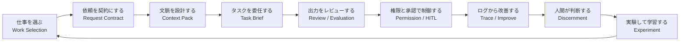

# Concept Map: AIエージェント協働の全体像

本書の中核は、AIを「回答生成器」ではなく、業務成果物を作る協働システムとして扱うことである。

## AIエージェント協働ループ



## 6つの設計層

| 層 | 問い | 主な成果物 | 対応章 |
|---|---|---|---|
| 1. Work | どの仕事にAIを使うか | AI適用判断シート | 第2章 |
| 2. Request | AIに何を依頼するか | AIエージェント依頼書 | 第3章 |
| 3. Context | AIに何を渡すか | Context Pack | 第4章 |
| 4. Delegation | どう分解し、どこで止めるか | Task Brief | 第5章 |
| 5. Control | どう検証し、どう制御するか | レビュー表、権限マトリクス、Run Log | 第6〜10章 |
| 6. Human / Org | 人間が何を判断し、どう学習するか | 判断チェックリスト、実験設計、スキルマップ | 第11〜16章 |

## 人間・業務・AIの責任境界

| 領域 | AIが担えること | 人間が担うこと |
|---|---|---|
| 情報整理 | 要約、分類、比較、候補生成 | 重要性判断、採否判断 |
| 下書き | メール、報告書、仕様案、議事録 | 外部送信、約束、責任ある表明 |
| 調査 | 情報収集、論点整理、出典候補 | 出典確認、解釈、意思決定 |
| 実行 | API呼び出し、PR作成、チケット起票 | 権限付与、承認、例外判断 |
| 学習 | 失敗ログの整理、改善案提示 | 何を続け、何をやめるかの判断 |

## 本書の基本式

```text
AIエージェント協働能力
= 仕事を選ぶ能力
+ 依頼を仕様化する能力
+ 文脈を設計する能力
+ 作業を分解して委任する能力
+ 出力と行動を検証・制御する能力
+ 人間が担う判断・対話・実験を劣化させない能力
```
