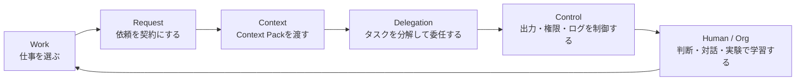

# 第1章 AIエージェント協働とは何か

## この章で扱う能力

この章では、AIエージェントを単なるチャット相手ではなく、業務成果を出すための協働システムとして扱うための前提を作る。読者は、チャットAI、ルールベース自動化、ワークフロー、AIエージェントの違いを説明できるようになる。また、人間、業務、AIの責任境界を分け、AIに任せる作業と人間が引き受ける判断を区別できるようになる。

この章の結論は明確である。

```text
AIエージェント協働とは、AIに仕事を丸投げすることではない。
人間が目的、制約、文脈、権限、確認点、停止条件を設計し、
AIが情報処理、生成、検索、分類、下書き、実行補助を担い、
人間が検証、承認、対話、最終判断、責任を担う仕事の進め方である。
```

AIエージェントは、出力を生成するだけでなく、外部情報を参照し、ツールを呼び、状態を持ち、複数ステップの作業を進める。そのため、使いこなす能力は「よいプロンプトを書く力」だけでは足りない。仕事の選定、依頼仕様、コンテキスト、権限、レビュー、ログ、人間判断までを一体で設計する必要がある。

## 本書全体における位置づけ

| 項目 | 内容 |
|---|---|
| 設計層 | Work以前の基礎 |
| 目的 | チャットAI、ワークフロー、AIエージェントの違いを整理し、協働システムとして扱う前提を作る。 |
| 主な成果物 | AIエージェント協働ブループリント |
| 参照 | [Concept Map](../../concept-map/)、[Artifact Index](../../artifact-index/)、[Troubleshooting Flow](../../troubleshooting/) |

本書の6層フレームワークは、次の流れでAIエージェント協働を扱う。

| 層 | 問い | 主な成果物 |
|---|---|---|
| Work | どの仕事にAIを使うか | AI適用判断シート |
| Request | AIに何を依頼するか | AIエージェント依頼書 |
| Context | AIに何を渡すか | Context Pack |
| Delegation | どう分解し、どこで止めるか | Task Brief |
| Control | どう検証し、どう制御するか | レビュー表、権限マトリクス、Run Log |
| Human / Org | 人間が何を判断し、どう学習するか | 判断チェックリスト、実験設計、スキルマップ |

第1章は、これらの前提となる章である。ここでAIエージェント協働の意味を取り違えると、第2章以降の設計がすべてずれる。たとえば、AIを「人間の代替」と見なすと、責任境界が曖昧になる。AIを「検索エンジンの強化版」と見なすと、権限、承認、ログの設計が抜ける。AIを「便利な文章生成ツール」と見なすと、業務成果物として閉じるところまで設計できない。

## なぜ必要か

AI活用の初期段階では、利用者はAIを質問応答ツールとして使う。議事録を要約する、文章を整える、翻訳する、コードの一部を説明させる、といった使い方であれば、チャットAIとしての理解でも効果は出る。

しかし、AIエージェントを業務に入れる段階では、話が変わる。AIエージェントは、次のような性質を持つ。

- 目的に応じて複数ステップで処理する
- 外部情報や社内文書を参照する
- ツール、API、SaaS、ファイル、コード実行環境を使う
- 途中状態を保持する
- 必要に応じて人間に確認を求める
- 出力だけでなく、下書き作成、チケット更新、PR作成、通知、検索、分類などの行動を伴う

この時点で、AI活用は「会話」ではなく「業務システム設計」に近づく。

業務システムとして見るなら、次の問いに答える必要がある。

```text
何を目的にするのか。
どの情報を使ってよいのか。
どの情報を使ってはいけないのか。
どのツールを使ってよいのか。
どの操作は人間承認が必要なのか。
どの出力はレビュー対象なのか。
どの条件で停止するのか。
実行履歴をどこに残すのか。
失敗したとき誰が対応するのか。
```

これらを設計せずにAIエージェントを導入すると、表面上は効率化されても、実際には事故、手戻り、責任不明、監査不能、業務負債が増える。

## チャットAI、ワークフロー、AIエージェントの違い

AIエージェントを理解するには、まず似ているものと区別する必要がある。重要なのは、使っているUIやモデル名ではなく、業務上どれだけ自律性、ツール権限、外部影響、不可逆性を持つかである。

| 区分 | 特徴 | 例 | 主なリスク | 必要な管理 |
|---|---|---|---|---|
| チャットAI | 入力に対して回答を生成する | 要約、翻訳、下書き、相談 | 誤情報、過信、機密投入 | 入力情報管理、出力レビュー |
| ルールベース自動化 | 決められた条件で決められた処理を実行する | 定期レポート生成、通知、ファイル変換 | 例外処理不足、設定ミス | テスト、例外処理、監視 |
| ワークフロー | 手順が定義された複数ステップ処理 | 問い合わせ分類→回答案→承認 | 手順外の状況に弱い | 分岐設計、承認、ログ |
| AIエージェント | 状況に応じて手順やツール利用を選びながら作業する | 調査、チケット処理、PR作成、障害分析 | 権限過大、誤実行、監査不能、責任不明 | 権限、HITL、評価、ログ、停止条件 |

境界は常に明確ではない。チャットAIにファイル検索やツール実行機能が加われば、実質的にはエージェントに近づく。逆に、AIエージェントと呼ばれていても、実態は固定手順のワークフローに近い場合もある。

本書では、名称ではなく次の6つでリスクを判断する。

| 判断軸 | 低リスク側 | 高リスク側 |
|---|---|---|
| 自律性 | 人間が毎回指示する | AIが次の手順を選ぶ |
| 情報アクセス | 手元の入力だけ | 社内文書、外部Web、DB、ログを参照する |
| ツール権限 | 参照のみ | 書き込み、送信、削除、本番変更が可能 |
| 外部影響 | 自分だけが見る | 顧客、取引先、外部システムに影響する |
| 可逆性 | 簡単に修正できる | 取り消し困難、損害が残る |
| 観測性 | 入出力を確認できる | 途中で何をしたか追えない |

AIエージェントらしさが増えるほど、便利になる。同時に、管理すべきものも増える。

## AIエージェント協働の定義

本書では、AIエージェント協働を次のように定義する。

```text
AIエージェント協働とは、
人間が目的、制約、判断基準、権限、確認点を設計し、
AIエージェントが検索、分類、抽出、生成、下書き、実行補助を担い、
人間が検証、承認、対話、最終判断、責任を担う仕事の進め方である。
```

この定義では、AIを「意思決定者」として扱わない。AIは候補を生成し、情報を整理し、処理を速める。だが、責任を負わない。AIが出した結論を採用するか、修正するか、棄却するかは人間が判断する。

協働という言葉には注意が必要である。協働とは、AIを同僚として擬人化することではない。協働とは、仕事を分解し、AIが担う処理と人間が担う責任を明確にすることである。

## AIエージェント協働ループ

本書では、AIエージェント協働を次のループとして扱う。

```text
仕事を選ぶ
→ 依頼を契約にする
→ Context Packを渡す
→ タスクを分解して委任する
→ 出力をレビューする
→ 権限と承認で制御する
→ ログから改善する
→ 人間が判断し、実験で学習する
```

このループの中心にあるのは、AIとの会話ではない。中心にあるのは、業務成果物、責任境界、レビュー、改善である。



詳細な全体像は [Concept Map](../../concept-map/) を参照する。

## 人間、業務、AIの3者を分ける

AIエージェント協働では、少なくとも3つの主体を分けて考える。

| 要素 | 主な役割 | 設計すべきもの |
|---|---|---|
| 人間 | 目的設定、判断、承認、対話、責任 | 判断基準、承認条件、レビュー観点、エスカレーション |
| 業務 | 入力、処理、出力、制約、関係者 | 業務フロー、成果物、完了条件、リスク分類 |
| AI | 検索、分類、抽出、生成、候補提示、実行補助 | Request Contract、Context Pack、ツール権限、停止条件、ログ |

AI活用が失敗する場合、この3者が混ざっていることが多い。

```text
人間が決めるべきことを、AIに判断させている。
業務上の制約を、AIに渡していない。
AIが出した候補を、レビューなしで成果物扱いしている。
AIのツール権限を、業務リスクより広く設定している。
```

人間、業務、AIを分けることは、AIを弱く使うことではない。むしろ、AIに任せる領域を明確にすることで、AIの処理能力を安全に使えるようにする。

## 「応答」ではなく「成果物」で考える

チャットAIの利用では、画面に返ってきた文章を「回答」と見なすことが多い。AIエージェント協働では、返ってきた文章だけでは仕事は終わらない。

仕事が終わったと言えるのは、次の条件を満たすときである。

```text
目的に合っている。
必要な情報を参照している。
推測と確定情報が分かれている。
人間がレビューしている。
必要な承認を通っている。
残リスクが明示されている。
実行履歴が残っている。
次に再利用できる形になっている。
```

つまり、AIの出力は「成果物の候補」である。成果物に変換するには、人間レビュー、承認、ログ、改善が必要になる。

たとえば、AIが作った顧客返信案は、返信案の時点では成果物ではない。顧客の状況、契約条件、障害影響、表現、宛先、送信可否を確認して初めて、送信可能な成果物に近づく。

## AIが担えること、担えないこと

AIエージェントに任せられることは多い。ただし、任せられる作業と任せてはいけない責任を混同してはいけない。

| AIが担えること | 人間が担うこと |
|---|---|
| 情報の検索、要約、分類、抽出 | 目的設定、優先順位、リスク許容 |
| 下書き、候補案、比較表の生成 | 最終判断、採用可否、説明責任 |
| チェックリストとの照合 | 例外判断、倫理的判断、対人判断 |
| ログや文書からの論点整理 | 顧客・取引先への約束、契約判断 |
| ツール実行の補助 | 権限付与、承認、停止判断 |
| テストケースやレビュー観点の生成 | 本番反映、外部送信、不可逆操作の承認 |

この分離は、AIを信頼しないという意味ではない。信頼の対象を明確にするという意味である。AIには、候補生成、整理、処理の速度を期待する。人間には、責任、判断、対話、承認を期待する。

## AIエージェント協働の最小構成

AIエージェント協働は、大規模なAI基盤を作らないと始められないわけではない。最小構成は、次の7点でよい。

| 構成要素 | 目的 | 対応する本書の章 |
|---|---|---|
| AI適用判断シート | どの仕事にAIを使うか決める | 第2章 |
| Request Contract | AIへの依頼を仕様化する | 第3章 |
| Context Pack | 必要な前提情報を渡す | 第4章 |
| Task Brief | 大きな仕事を委任可能にする | 第5章 |
| AI出力レビュー表 | 出力を成果物に変換する | 第6章 |
| ツール権限マトリクス | AIが実行できる範囲を制御する | 第7章 |
| Agent Run Log | 実行履歴を改善へつなげる | 第8章 |

この7点があれば、AI活用は個人のプロンプト技術から、組織内で再利用できる仕事の型に変わる。

## 典型的な失敗

### 失敗1: AIを人間の部下のように扱う

人間の部下は、組織の文脈、暗黙知、過去の会話、人間関係、政治的制約をある程度推測する。AIエージェントは、渡された文脈と利用可能なツールの範囲で処理する。暗黙知を前提にした依頼は失敗しやすい。

悪い依頼:

```text
この件、いい感じにまとめておいて。
```

この依頼では、目的、読者、範囲、使ってよい情報、使ってはいけない情報、出力形式、確認観点、不明点の扱いが不明である。人間なら確認してくれるかもしれない。AIは、文脈からもっともらしい出力を生成する可能性がある。

必要な指定は次のようなものである。

```text
目的：経営会議で価格改定を議論するため、競合比較の材料を作る。
読者：経営陣、営業責任者、プロダクト責任者。
対象：法人向けバックアップサービス。個人向けサービスは除外。
出力：比較表、要確認事項、判断に使える論点。
制約：不明な情報は推測せず「要確認」と書く。
```

### 失敗2: AIの自律性を過大評価する

AIエージェントが複数ステップで動けることと、業務上正しい判断ができることは別である。特に、顧客影響、法務、価格、契約、本番環境、個人情報を含む処理では、人間承認が必要になる。

AIが「次にやるべきこと」を提示しても、それは業務上の承認ではない。AIが「問題なさそうです」と出力しても、それはリスク受容ではない。AIが「送信文を作成しました」と出力しても、それは送信承認ではない。

### 失敗3: 出力だけを見てプロセスを見ない

AIの出力が整っていると、途中で何を参照し、何を仮定し、どのツールを呼び、どこで失敗したかを確認しないまま採用しがちである。

AIエージェント運用では、最終出力だけでなく、次の情報を見る必要がある。

```text
入力として何を渡したか。
どの文書やデータを参照したか。
どの情報を推測したか。
どのツールを使ったか。
ツール実行は成功したか。
人間レビューで何を修正したか。
次回改善すべき点は何か。
```

### 失敗4: チャットでうまくいった業務を、そのまま自動化する

チャットで顧客返信案を作らせることと、顧客返信を自動送信させることは、リスクがまったく違う。チャットでコード修正案を作らせることと、本番ブランチに自動反映させることも違う。

AI活用の段階が、下書きから実行へ進むほど、権限、承認、ログ、停止条件が必要になる。

### 失敗5: 人間の判断回避に使う

AIは、難しい意思決定や困難な会話を先送りする口実にもなる。

```text
AIがこう言っているから、この方針でよいはずだ。
AIに聞いたら優先度が低いと言っていた。
AIが作った文面だから、このまま送ればよい。
```

この言い方は、実際には自分の判断や対話を回避している可能性がある。AIは判断材料を増やすために使う。判断責任を外部化するために使わない。

### 失敗6: ログを残さず、成功も失敗も再利用できない

個人がチャットでうまくいったプロンプトを使い、その場で成果を出すだけでは、組織能力にならない。何を依頼し、何を渡し、どの出力が出て、どこを人間が直したかが残っていなければ、次回改善できない。

AI活用を組織能力にするには、実行ログ、レビュー結果、失敗事例、改善アクションを残す必要がある。

## 設計原則

### 原則1: AIに任せるのは作業であり、責任ではない

AIは、調査、要約、下書き、分類、候補生成、チェック補助を担える。しかし、顧客に送る、契約条件を決める、採用可否を判断する、本番環境を変更する、といった責任を伴う行為は人間が承認する。

### 原則2: 依頼は会話ではなく仕様にする

AIへの依頼は、雑談ではなく小さな仕様書として書く。目的、入力、制約、出力、受け入れ条件、不明点の扱いを明示する。これを本書では Request Contract と呼ぶ。

### 原則3: コンテキストは設計物である

AIの出力品質は、モデルだけでなく、渡された文脈に大きく依存する。社内ルール、過去経緯、制約、最新情報、禁止事項を構造化して渡す。これを Context Pack と呼ぶ。

### 原則4: 権限は小さく始める

AIエージェントには、最初から書き込みや送信の権限を与えない。まず read-only、次に draft-only、次に approval-required の順で広げる。不可逆な操作は人間承認を必須にする。

### 原則5: 停止条件を先に決める

AIがいつ止まるかを決めないまま作業させると、不要な調査、コスト超過、誤った前提での継続、外部影響の拡大が起きる。件数、時間、確信度、エラー、未確認情報、リスク検出を停止条件として定義する。

### 原則6: 出力ではなく仕事を閉じる

AIが文章を出しただけでは仕事は終わらない。仕事が閉じた状態とは、目的を満たし、根拠があり、レビューされ、必要な承認を通り、ログが残り、次に再利用できる状態である。

### 原則7: 人間の介入点を設計する

人間が毎回すべてを見ると、AI導入の効果は下がる。一方、人間がまったく見ないと事故が増える。したがって、人間は「どこで必ず見るか」「どの条件なら見なくてよいか」「どの条件なら止めるか」を設計する。

### 原則8: 改善可能な形で使う

AI活用は一回限りの成功ではなく、継続改善の対象である。Request Contract、Context Pack、レビュー指摘、ログ、失敗事例を残し、次回の品質を上げる。

## 実務ケース: 顧客問い合わせ対応

本書では、架空企業 ITDO Cloud Services を継続ケースとして使う。同社は法人向けバックアップ、監視、マネージドインフラ支援を提供している。

ある顧客から、次の問い合わせが届いたとする。

```text
昨日からバックアップジョブが失敗しています。至急確認してください。
```

この問い合わせに対するAI利用を、3つの段階で比較する。

### チャットAIとして使う場合

担当者が問い合わせ文を貼り付け、返信案を作らせる。

```text
この問い合わせへの返信案を作ってください。
```

出力は早い。しかし、この使い方では次の情報が不足する。

```text
顧客の契約プラン
SLA
障害影響の有無
過去チケット
実際のバックアップログ
社内の障害情報
顧客に伝えてよい範囲
送信前承認者
```

チャットAIは、返信案の素材作成には使える。しかし、このまま顧客送信してはいけない。

### ワークフローとして使う場合

あらかじめ手順を決める。

```text
問い合わせ受信
→ 種別分類
→ FAQ検索
→ 回答案作成
→ 人間レビュー
→ 顧客送信
→ チケット更新
```

この方式は安定する。典型的な問い合わせには有効である。一方、FAQにない障害、契約影響、SLA影響、セキュリティ疑いがある場合は、人間にエスカレーションする条件が必要になる。

### AIエージェント協働として使う場合

AIエージェントには、処理だけでなく、確認条件と停止条件も与える。

| ステップ | AIが担うこと | 人間が担うこと | 停止・確認条件 |
|---|---|---|---|
| 受信 | 問い合わせ種別、緊急度、必要情報を分類する | 優先度の最終確認 | 顧客影響が不明なら確認 |
| 情報収集 | FAQ、過去チケット、関連ログを検索する | 参照範囲の妥当性確認 | 契約・SLAに関係する場合は停止 |
| 状況整理 | 事実、推測、要確認を分ける | 障害影響の判断 | 原因未確定なら断定禁止 |
| 回答案作成 | 顧客返信案と追加確認事項を作る | 送信前レビュー | 外部送信は必ず承認 |
| 記録 | チケット要約、次アクションを下書きする | 最終コメント確定 | 顧客約束を含む場合は承認 |

このケースで重要なのは、AIに「顧客へ直接返信する権限」を与えないことである。AIは、分類、検索、整理、下書き、記録補助を担う。顧客送信、SLA判断、原因断定、補償や契約に関わる発言は人間が扱う。

## 作成する成果物: AIエージェント協働ブループリント

この章では、AIエージェント協働の最小設計図を作る。これを以後の章で、AI適用判断シート、Request Contract、Context Pack、Task Brief、レビュー表、権限マトリクスへ分解していく。

```text
業務名：
業務目的：
最終成果物：
AIに任せる作業：
人間が判断すること：
AIに渡す情報：
AIに渡してはいけない情報：
AIが使ってよいツール：
AIが使ってはいけないツール：
人間確認が必要な条件：
停止条件：
ログとして残す情報：
失敗時の対応：
次に改善する点：
```

### 記入例

```text
業務名：顧客問い合わせ一次対応
業務目的：問い合わせ内容を分類し、担当者が確認しやすい状態にする。
最終成果物：チケット要約、関連情報、回答案、要確認事項。
AIに任せる作業：分類、FAQ検索、過去チケット検索、回答案作成、要確認事項抽出。
人間が判断すること：顧客送信可否、SLA影響、原因断定、エスカレーション要否。
AIに渡す情報：問い合わせ本文、公開FAQ、関連チケット、ログ要約。
AIに渡してはいけない情報：不要な個人情報、認証情報、契約外の顧客情報。
AIが使ってよいツール：FAQ検索、チケット検索、ログ検索のread-only。
AIが使ってはいけないツール：顧客メール送信、契約情報更新、本番環境変更。
人間確認が必要な条件：外部送信、SLA影響、障害疑い、原因未確定。
停止条件：必要ログがない、契約影響がある、顧客影響が不明、セキュリティ疑い。
ログとして残す情報：入力、参照資料、出力、レビュー結果、承認者、修正点。
失敗時の対応：担当者にエスカレーションし、AI出力は下書き扱いにする。
```

## チェックリスト

AIエージェント協働として扱う前に、次を確認する。

- [ ] AIに任せる作業と、人間が決める判断を分けたか
- [ ] AIが参照してよい情報と、参照してはいけない情報を分けたか
- [ ] AIが実行してよいツールと、承認が必要な操作を分けたか
- [ ] 外部送信、削除、更新、本番変更をAI単独で実行しない設計になっているか
- [ ] 出力だけでなく、根拠、参照情報、ログを確認できるか
- [ ] 失敗時に人間へエスカレーションする条件があるか
- [ ] AI活用の成功条件と停止条件があるか
- [ ] 次回改善に使える記録が残るか

関連するチェックリストは [付録B: チェックリスト集](../../appendices/appendix-b/) を参照する。

## 演習

自分の業務から、AIエージェントに任せたい作業を1つ選ぶ。次の表を埋める。

| 項目 | 記入 |
|---|---|
| 業務名 |  |
| 業務目的 |  |
| 最終成果物 |  |
| AIに任せたい作業 |  |
| 人間が判断すべきこと |  |
| AIに渡すべき情報 |  |
| AIに渡してはいけない情報 |  |
| 使わせたいツール |  |
| 使わせてはいけないツール |  |
| 承認が必要な操作 |  |
| 停止条件 |  |
| ログとして残す情報 |  |
| 失敗時の対応 |  |

### 演習の判定基準

次の条件を満たしていれば、この章の演習としては合格である。

- AIに任せる作業が、処理、整理、下書き、候補生成のいずれかとして書かれている
- 人間が判断すべきことに、承認、外部影響、リスク受容のいずれかが含まれている
- AIに渡してはいけない情報が具体的に書かれている
- ツール権限が read-only、draft-only、approval-required のように分かれている
- 停止条件が少なくとも1つある

## 章の受け入れ基準

- AIエージェントとチャットAIを区別できる
- AIエージェント協働を、業務成果、権限、レビュー、ログを含む仕事の進め方として説明できる
- 人間・業務・AIの責任境界を説明できる
- 協働ループの各段階を説明できる
- AIエージェント協働ブループリントを1つ作成できる

詳細は [Chapter Acceptance Criteria](https://github.com/itdojp/ai-agent-collaboration-book/blob/main/planning/chapter-acceptance-criteria.md) を参照する。

## 関連書籍への接続

- AIエージェントの Prompt / Context / Harness を深く扱う場合は『AIエージェント実践: Prompt / Context / Harness Engineering』へ進む。
- GitHub 上のAIエージェント運用は『GitHub AgentOps 実践ガイド』へ進む。
- AI時代の意思決定、責任境界、運用統制は『AI時代のプロフェッショナルITエンジニアの思考法』へ進む。
- Issue、完了条件、レビュー可能な作業単位は『チケット駆動の仕事術』へ接続する。

## Source Notes

本章のAIエージェント定義は、本書内の実務設計上の定義であり、特定ベンダーの製品分類ではない。AIエージェントを、ツール、状態、ガードレール、評価、観測性を含む業務システムとして扱う観点は、以下の外部資料を参照軸にしている。

```text
出典キー: SRC-OPENAI-AGENTS, SRC-ANTHROPIC-CONTEXT
詳細URLと確認日は source-notes.md を参照。
```

モデル名、料金、UI、API仕様、エージェント機能は変化しやすい。実装時には、利用するAI基盤の公式ドキュメントと社内規程を確認する。

## まとめ

AIエージェント協働とは、AIに仕事を丸投げすることではない。目的、文脈、権限、確認、停止条件、ログを設計し、人間が判断と責任を持つ形でAIを業務に組み込むことである。

次章では、どの仕事をAIに任せるべきか、逆に任せてはいけない仕事は何かを整理する。AI活用の第一歩は、よいプロンプトを書くことではなく、任せる仕事を選ぶことである。
