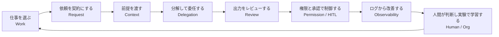

# F-00: AIエージェント協働ループ

Mermaidソース

この図は本書全体の基本ループである。AI活用を単発のプロンプトではなく、業務成果へ変換する反復プロセスとして扱う。

## 関連章・利用箇所

### 関連章

- [第1章 AIエージェント協働とは何か](../../chapters/chapter-01/): AIエージェント協働ループの基本概念を確認する。

### 本文での利用箇所

- [Concept Map](../../concept-map/): 本書全体の反復ループとして参照する。
- [第1章 AIエージェント協働とは何か](../../chapters/chapter-01/): チャット利用と業務協働システムの違いを説明する。

[← 図表索引へ戻る](../../figure-index/)
