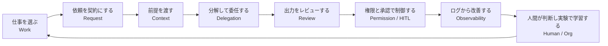

# F-00: AIエージェント協働ループ

```mermaid
flowchart LR
    A[仕事を選ぶ<br/>Work] --> B[依頼を契約にする<br/>Request]
    B --> C[前提を渡す<br/>Context]
    C --> D[分解して委任する<br/>Delegation]
    D --> E[出力をレビューする<br/>Review]
    E --> F[権限と承認で制御する<br/>Permission / HITL]
    F --> G[ログから改善する<br/>Observability]
    G --> H[人間が判断し実験で学習する<br/>Human / Org]
    H --> A
```

この図は本書全体の基本ループである。AI活用を単発のプロンプトではなく、業務成果へ変換する反復プロセスとして扱う。
