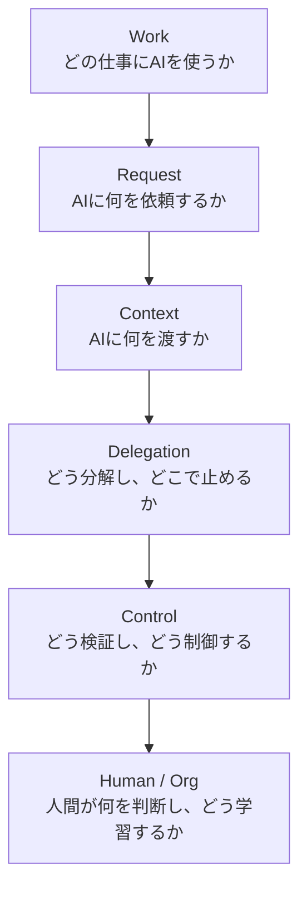

# F-01: 6層モデル

Mermaidソース

6層モデルは、章構成と成果物体系を整理するための背骨である。

## 関連章・利用箇所

### 関連章

- [第0章 本書の読み方](../../reading-guide/): 読み進め方と章構成を確認する。
- [第1章 AIエージェント協働とは何か](../../chapters/chapter-01/): 6層モデルの全体像を理解する。

### 本文での利用箇所

- [第0章 本書の読み方](../../reading-guide/): 読者別導線と成果物体系の見取り図として使う。
- [第1章 AIエージェント協働とは何か](../../chapters/chapter-01/): 本書の中核フレームワークとして使う。

[← 図表索引へ戻る](../../figure-index/)
