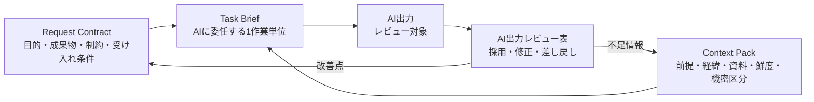

# F-02: Request Contract / Context Pack / Task Brief の関係

Mermaidソース

Request Contractは「何をしてほしいか」、Context Packは「何を前提にするか」、Task Briefは「どの作業単位として委任するか」を定義する。

## 関連章・利用箇所

### 関連章

- [第3章 依頼を契約にする](../../chapters/chapter-03/): Request Contractを定義する。
- [第4章 Context Packを設計する](../../chapters/chapter-04/): 前提と制約を渡す。
- [第5章 タスク分解と委任](../../chapters/chapter-05/): Task Briefへ落とす。

### 本文での利用箇所

- [第3章 依頼を契約にする](../../chapters/chapter-03/): 第3章〜第5章で、Request、Context、Delegationの接続を説明する。

[← 図表索引へ戻る](../../figure-index/)
