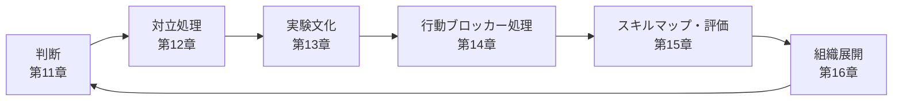

# F-04: Human / Org層の流れ

```mermaid
flowchart LR
    DEC[判断<br/>第11章] --> CONFLICT[対立処理<br/>第12章]
    CONFLICT --> EXP[実験文化<br/>第13章]
    EXP --> ACTION[行動ブロッカー処理<br/>第14章]
    ACTION --> SKILL[スキルマップ・評価<br/>第15章]
    SKILL --> ROLL[組織展開<br/>第16章]
    ROLL --> DEC
```

Human / Org層では、AIが代替しにくい判断、対話、実験、行動、育成、展開を扱う。
