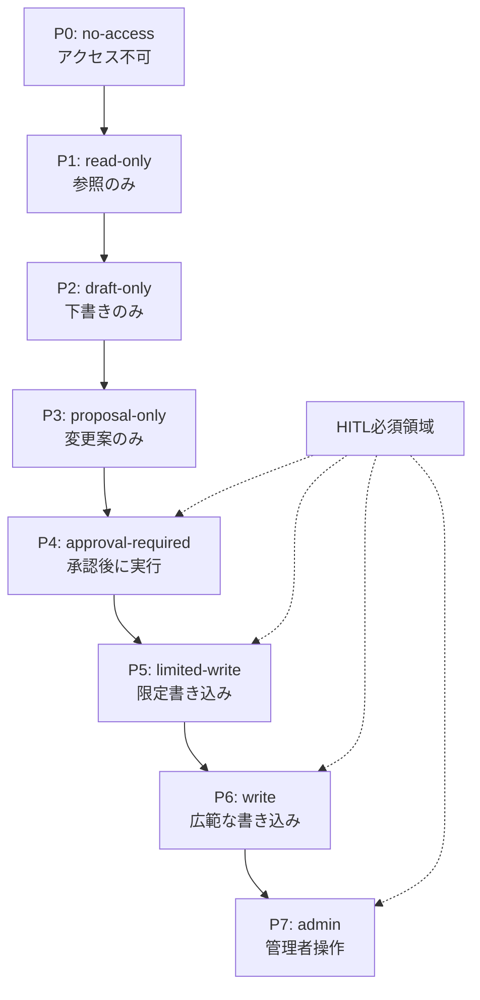

# F-07: 権限レベル梯子

Mermaidソース

権限は「ツール単位」ではなく「操作単位」で設計する。原則として、外部影響、データ更新、顧客影響、本番影響、不可逆操作がある場合は `P4: approval-required` 以上として扱う。

| レベル | AIができること | 代表例 | 基本制御 |
|---|---|---|---|
| P0 | アクセスしない | 本番DB、秘匿契約、給与情報 | 接続禁止 |
| P1 | 参照のみ | 社内FAQ検索、監視ログ参照 | read-only、ログ記録 |
| P2 | 下書きのみ | 顧客返信案、議事録案 | 人間レビュー |
| P3 | 変更案のみ | PR案、設定変更案 | 差分表示、レビュー |
| P4 | 承認後に実行 | チケット作成、CRM更新 | HITL承認 |
| P5 | 限定書き込み | 特定ラベル付与、限定Wiki更新 | スコープ制限、ロールバック |
| P6 | 広範な書き込み | 複数システム更新 | 強い承認、監査 |
| P7 | 管理者操作 | 権限変更、削除、課金変更 | 原則禁止または例外承認 |

第7章では、この梯子を使ってツール権限マトリクス、HITL承認フロー、Permission Testを設計する。

## 関連章・利用箇所

### 関連章

- [第7章 ツール・権限・HITL](../../chapters/chapter-07/): ツール権限と承認ゲートを設計する。

### 本文での利用箇所

- [第7章 ツール・権限・HITL](../../chapters/chapter-07/): AIに与える操作権限を段階化して確認する。

[← 図表索引へ戻る](../../figure-index/)
