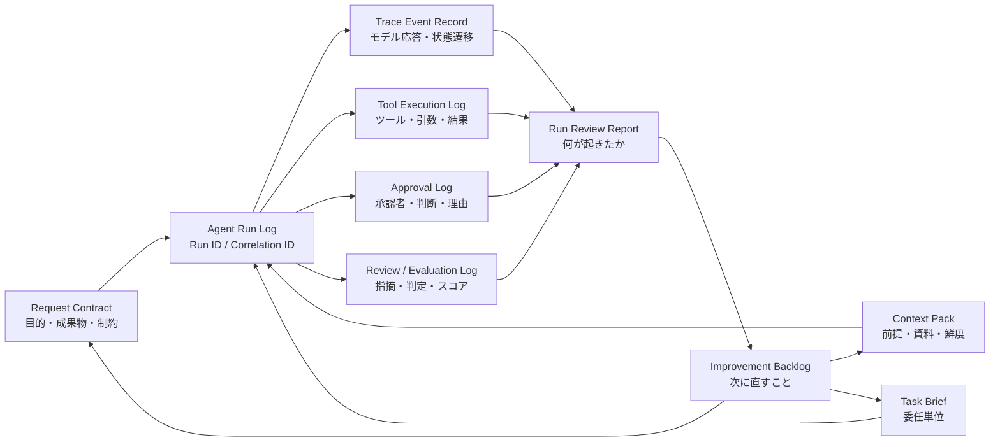

# F-08: Agent Run Logの流れ

Mermaidソース

ログは、最終出力を保存するだけでは不十分である。依頼、前提、委任単位、ツール実行、承認、レビュー、失敗、改善アクションをRun単位で接続する。

| 記録単位 | 目的 | 注意点 |
|---|---|---|
| Run ID | 一連のAI実行を追跡する | 顧客影響・本番影響があるRunは必ず付与する |
| Trace Event | 処理過程を説明する | 機密情報の過剰記録を避ける |
| Tool Execution | 何を実行したかを残す | 引数、対象、結果、エラーを残す |
| Approval | 誰が何を承認したかを残す | 承認理由と却下理由を残す |
| Review / Evaluation | 出力品質を改善へ戻す | 指摘を前工程へ接続する |

第8章では、この流れを使って、再現、説明、監査、改善に使える実行証跡を設計する。

## 関連章・利用箇所

### 関連章

- [第8章 ログ・トレース・継続改善](../../chapters/chapter-08/): Run単位の証跡を設計する。

### 本文での利用箇所

- [第8章 ログ・トレース・継続改善](../../chapters/chapter-08/): 依頼、前提、ツール実行、承認、レビュー、改善バックログを接続する。

[← 図表索引へ戻る](../../figure-index/)
