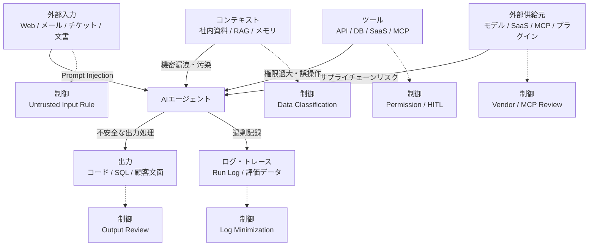

# F-09: AIセキュリティリスクマップ

Mermaidソース

AIエージェントのセキュリティは、モデル単体の問題ではない。入力、文脈、ツール、出力、ログ、外部供給元をまたぐ業務システムの設計問題である。

| 攻撃面 | 典型リスク | 対応する成果物 |
|---|---|---|
| 外部入力 | プロンプトインジェクション、偽指示 | Untrusted Input Handling Rule、Prompt Injection Test Sheet |
| コンテキスト | 機密投入、古い情報、メモリ汚染 | Data Classification and Handling Matrix、Context Pack |
| ツール | 権限過大、誤更新、不可逆操作 | ツール権限マトリクス、HITL承認フロー |
| 出力 | 未検証SQL、コード、顧客送信 | AI出力レビュー表、Review Issue Log |
| ログ | 個人情報・機密情報の残存 | Agent Run Log、ログマスキング方針 |
| 外部供給元 | SaaS、MCP、プラグインの信頼性 | External Tool / MCP Review Sheet、Vendor Review Record |

第9章では、このリスクマップを使って、AI Security ChecklistとPrivacy Impact Reviewを設計する。

## 関連章・利用箇所

### 関連章

- [第9章 セキュリティとプライバシー](../../chapters/chapter-09/): AI固有リスクを棚卸しする。

### 本文での利用箇所

- [第9章 セキュリティとプライバシー](../../chapters/chapter-09/): 入力、文脈、ツール、出力、ログ、外部供給元を攻撃面として確認する。

[← 図表索引へ戻る](../../figure-index/)
