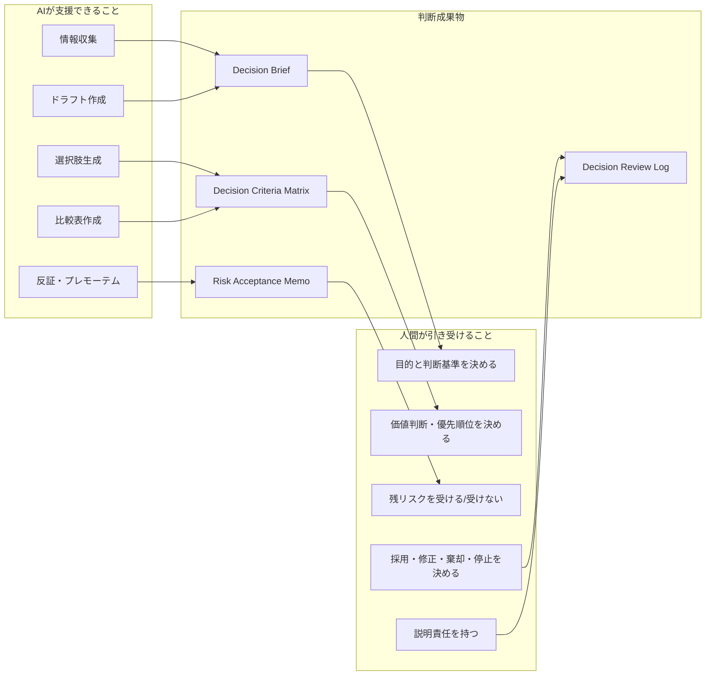

# F-11: 判断責任分界

AIは判断材料を作れるが、判断責任を引き受けることはできない。AI時代の判断力は、AI提案を信じる力ではなく、何を採用し、何を捨て、何を止め、どのリスクを誰が受けるかを明示する力である。

| 領域 | AIに任せられること | 人間が決めること |
|---|---|---|
| 目的 | 目的案の整理 | 最終目的、優先順位 |
| 情報 | 調査、要約、比較 | 信頼できる根拠の採用 |
| 選択肢 | 案、反対意見、リスク列挙 | 採用、棄却、保留、実験化 |
| リスク | リスク候補の抽出 | 残リスクの受容または拒否 |
| 説明 | 説明文の下書き | 誰にどう説明し、責任を持つか |

第11章では、この責任分界をDecision Brief、Kill Decision Sheet、Risk Acceptance Memoへ落とす。
