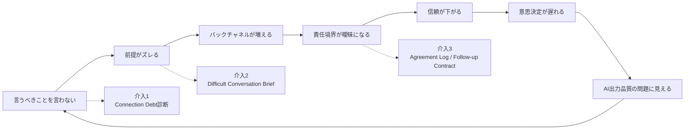

# F-12: Connection Debtの蓄積構造

Mermaidソース

Connection Debtは、重要な相手に言うべきことを言わないことで蓄積する組織負債である。AI導入が進むと、未合意の前提や責任境界がAI出力の品質問題に見えやすくなる。

| 蓄積段階 | 兆候 | 必要な介入 |
|---|---|---|
| 言えていない | 懸念を本人に伝えず、周囲にだけ話す | Connection Debt診断 |
| 前提がズレる | 営業、開発、CS、管理職で期待が違う | Conflict Type Map |
| バックチャネル化 | 会議外で不満が増える | Backchannel Control Rule |
| 責任境界不明 | 誰が決めるか不明なままAIに作業させる | Difficult Conversation Brief |
| 信頼低下 | レビューが人格評価に見える | Perspective Map |
| 意思決定停滞 | 判断が会議で決まらず先送りされる | Agreement Log、Follow-up Contract |

第12章では、AIを「対話の代替」ではなく、対立構造の整理と直接会話の準備に使う。
