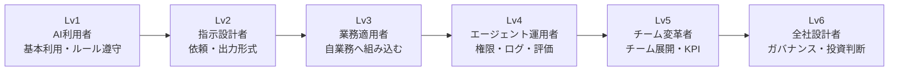

# F-15: スキルレベルマップ

Mermaidソース

スキルレベルは、プロンプトの上手さだけでは判定しない。成果物、実技課題、レビュー証跡、運用証跡、判断記録を組み合わせて評価する。

| レベル | 主なスコープ | 評価証拠の例 | 権限・役割への接続 |
|---|---|---|---|
| Lv1 | 個人利用 | 基本プロンプト、禁止事項テスト | 一般利用 |
| Lv2 | 依頼設計 | Request Contract、Context Pack | 標準テンプレート利用 |
| Lv3 | 業務適用 | AI適用判断シート、レビュー表、実験設計 | 業務内AI活用リード |
| Lv4 | 運用設計 | 権限マトリクス、Run Log、Evaluation Plan | エージェント運用担当 |
| Lv5 | チーム展開 | Role Skill Profile、KPI、Office Hour運用 | AI Team Lead |
| Lv6 | 全社設計 | AI System Inventory、Risk Register、Governance Review | AI Governance Owner / CoE |

第15章では、このマップを12能力領域、Role Skill Profile、Evidence Portfolio、Certification Criteriaへ展開する。第16章では、評価結果を教材化、権限付与、Office Hour、90日展開計画へ接続する。

## 関連章・利用箇所

### 関連章

- [第15章 スキルマップと評価](../../chapters/chapter-15/): スキルレベルと評価証拠を定義する。
- [第16章 組織展開と教材化](../../chapters/chapter-16/): 評価結果を教材化と権限付与へ接続する。

### 本文での利用箇所

- [第15章 スキルマップと評価](../../chapters/chapter-15/): Lv1〜Lv6を評価証拠と権限・役割に対応づける。
- [第16章 組織展開と教材化](../../chapters/chapter-16/): Role-based Learning Pathや認定運用へ接続する。

[← 図表索引へ戻る](../../figure-index/)
