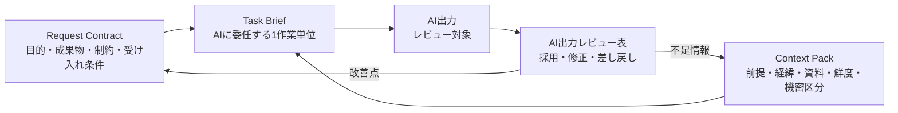

# F-02: Request Contract / Context Pack / Task Brief の関係

Mermaidソース

```mermaid
flowchart LR
    RC[Request Contract<br/>目的・成果物・制約・受け入れ条件]
    CP[Context Pack<br/>前提・経緯・資料・鮮度・機密区分]
    TB[Task Brief<br/>AIに委任する1作業単位]
    OUT[AI出力<br/>レビュー対象]
    REV[AI出力レビュー表<br/>採用・修正・差し戻し]

    RC --> TB
    CP --> TB
    TB --> OUT
    OUT --> REV
    REV -->|改善点| RC
    REV -->|不足情報| CP
```

Request Contractは「何をしてほしいか」、Context Packは「何を前提にするか」、Task Briefは「どの作業単位として委任するか」を定義する。
