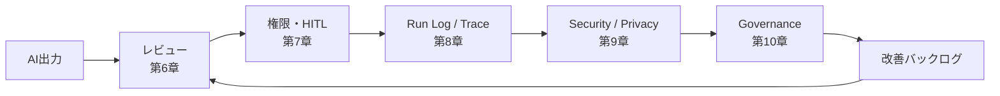

# F-03: Control層の流れ

Mermaidソース

Control層では、AI出力だけでなく、ツール実行、承認、ログ、セキュリティ、ガバナンスを一体で扱う。

## 関連章・利用箇所

### 関連章

- [第6章 AI出力レビューと評価](../manuscript/ch06-review-evaluation.md): レビューと評価を設計する。
- [第7章 ツール・権限・HITL](../manuscript/ch07-tool-permission-hitl.md): 権限と承認を設計する。
- [第8章 ログ・トレース・継続改善](../manuscript/ch08-logs-observability.md): Run単位の記録を設計する。
- [第9章 セキュリティとプライバシー](../manuscript/ch09-security-privacy.md): AI固有リスクを扱う。
- [第10章 ガバナンスと統制](../manuscript/ch10-governance.md): 統制サイクルへ接続する。

### 本文での利用箇所

- [第6章 AI出力レビューと評価](../manuscript/ch06-review-evaluation.md): 第6章〜第10章で、Control層の流れとしてレビューからガバナンスまでを通しで確認する。

[← 図表索引へ戻る](../figure-index.md)
