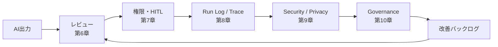

# F-03: Control層の流れ

```mermaid
flowchart LR
    OUT[AI出力] --> REVIEW[レビュー<br/>第6章]
    REVIEW --> PERM[権限・HITL<br/>第7章]
    PERM --> LOG[Run Log / Trace<br/>第8章]
    LOG --> SEC[Security / Privacy<br/>第9章]
    SEC --> GOV[Governance<br/>第10章]
    GOV --> IMP[改善バックログ]
    IMP --> REVIEW
```

Control層では、AI出力だけでなく、ツール実行、承認、ログ、セキュリティ、ガバナンスを一体で扱う。
