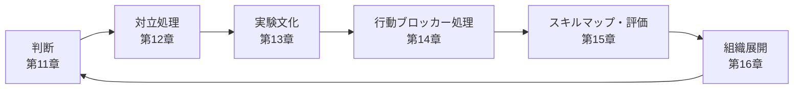

# F-04: Human / Org層の流れ

Mermaidソース

Human / Org層では、AIが代替しにくい判断、対話、実験、行動、育成、展開を扱う。

## 関連章・利用箇所

### 関連章

- [第11章 AI時代の判断力](../manuscript/ch11-discernment.md): 判断責任を扱う。
- [第12章 困難な会話と対立処理](../manuscript/ch12-conflict-connection-debt.md): 対話と対立を扱う。
- [第13章 失敗耐性と実験文化](../manuscript/ch13-experiment-culture.md): 実験と学習を扱う。
- [第14章 セルフトークと高レバレッジ環境](../manuscript/ch14-self-talk.md): 行動停止を扱う。
- [第15章 スキルマップと評価](../manuscript/ch15-skill-map.md): 能力評価を扱う。
- [第16章 組織展開と教材化](../manuscript/ch16-org-rollout.md): 展開と教材化を扱う。

### 本文での利用箇所

- [第11章〜第16章](../manuscript/ch11-discernment.md): Human / Org層の章間接続を確認する。

[← 図表索引へ戻る](../figure-index.md)
