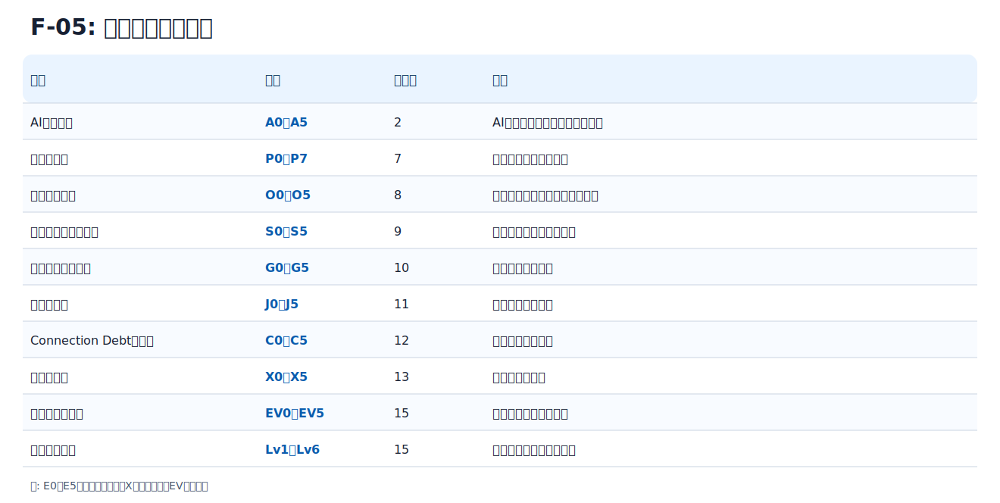

# F-05: レベル接頭辞一覧

| 領域 | 表記 | 主な章 | 用途 |
|---|---|---:|---|
| AI適用段階 | A0〜A5 | 2 | AIをどこまで業務へ組み込むか |
| 権限レベル | P0〜P7 | 7 | ツール操作権限の強さ |
| 観測性レベル | O0〜O5 | 8 | ログ、トレース、改善の成熟度 |
| セキュリティレベル | S0〜S5 | 9 | セキュリティ管理の重さ |
| ガバナンスレベル | G0〜G5 | 10 | 組織統制の成熟度 |
| 判断レベル | J0〜J5 | 11 | 人間判断の明示度 |
| Connection Debtレベル | C0〜C5 | 12 | 未処理対立の重さ |
| 実験レベル | X0〜X5 | 13 | 実験の影響範囲 |
| 評価証拠レベル | EV0〜EV5 | 15 | 認定に使う証拠の強さ |
| スキルレベル | Lv1〜Lv6 | 15 | 個人・チーム・全社能力 |

`E0〜E5` は使わない。実験は `X`、評価証拠は `EV` を使う。
