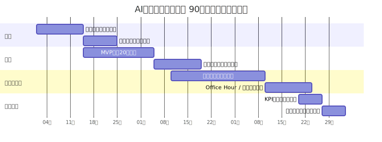
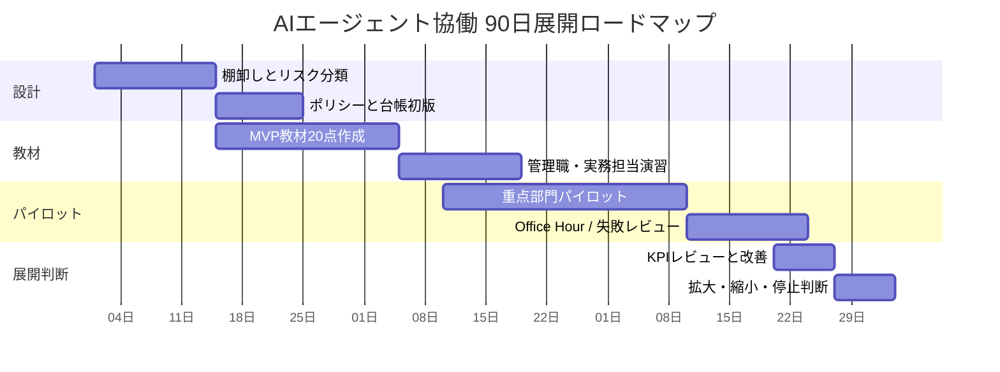

# F-06: 90日展開ロードマップ

Mermaidソース

日付は例である。実務では90日を4フェーズに分け、設計、教材、パイロット、展開判断を行う。

## 関連章・利用箇所

### 関連章

- [第16章 組織展開と教材化](../manuscript/ch16-org-rollout.md): 90日展開の計画を設計する。

### 本文での利用箇所

- [第16章 組織展開と教材化](../manuscript/ch16-org-rollout.md): 設計、教材、パイロット、展開判断の順序を説明する。

[← 図表索引へ戻る](../figure-index.md)
