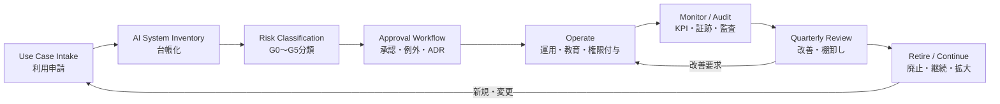

# F-10: AIガバナンス運用サイクル

Mermaidソース

AIガバナンスは、AI利用を止めるためではなく、安全にスケールさせるための運用サイクルである。低リスク利用は速く通し、高リスク利用は台帳、承認、証跡、教育、廃止まで管理する。

| サイクル | 主な問い | 成果物 |
|---|---|---|
| Intake | 何にAIを使うのか | AI Use Case Intake |
| Inventory | 誰が何を使っているか | AI System Inventory |
| Classification | どの統制レベルか | Governance Level Matrix、AI Risk Register |
| Approval | 誰が何を承認するか | Approval Workflow、AI System ADR |
| Operate | 教育・権限・運用は十分か | AI Training Register、Office Hour Runbook |
| Monitor | 品質・リスク・コストは見えているか | KPI Dashboard、Audit Evidence Pack |
| Review | 続けるか、直すか、止めるか | Quarterly Review Report、AI Retirement Plan |

第10章では、このサイクルをAI CoE、部門責任者、情シス、法務、セキュリティの運用責任へ接続する。

## 関連章・利用箇所

### 関連章

- [第10章 ガバナンスと統制](../manuscript/ch10-governance.md): 統制サイクルを設計する。

### 本文での利用箇所

- [第10章 ガバナンスと統制](../manuscript/ch10-governance.md): 利用申請、台帳化、分類、承認、運用、監査、廃止を循環として扱う。

[← 図表索引へ戻る](../figure-index.md)
