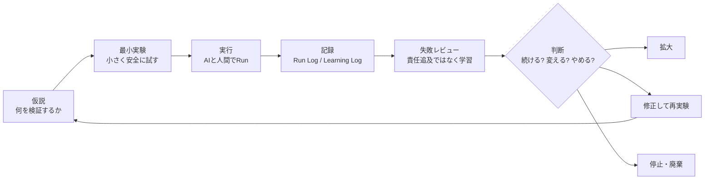

# F-13: 実験学習ループ

Mermaidソース

実験文化は、失敗を美化することではない。成功条件、失敗条件、即時停止条件、やめる条件を先に決め、実験結果を学習ログと廃棄判断へ接続することである。

| ループ | 成果物 | 確認すること |
|---|---|---|
| 仮説 | AI実験設計シート | 何が分かれば次の判断に進めるか |
| 最小実験 | 20 Experiments Sheet | 影響範囲を小さくできているか |
| 実行 | Agent Run Log | 何を試したか再現できるか |
| 記録 | Learning Log | 結果ではなく学習が残っているか |
| 失敗レビュー | Failure Review Sheet | 失敗が責任追及になっていないか |
| 判断 | Experiment Kill Criteria | 拡大、修正、停止の基準があるか |

第13章では、判断できない論点や未処理の対立を、検証可能な小実験へ変換する。
