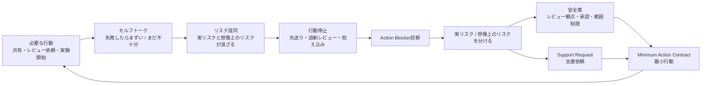

# F-14: Action Blocker構造

Mermaidソース

セルフトークは、個人の気分だけではなく、実験速度、レビュー依頼、判断、共有を止める業務上の摩擦になる。重要なのは、自己批判をなくすことではなく、止まっている行動を特定し、レビュー可能な最小行動へ変換することである。

| ブロッカー | 典型文 | 変換先 |
|---|---|---|
| 完璧主義 | もっと完成してから出す | 80%ドラフトをレビュー依頼する |
| 評価不安 | 批判されたら終わり | レビュー観点を指定して依頼する |
| AI不安 | AIを使うと自分の価値が下がる | AIで浮いた時間の使途を決める |
| 過剰責任 | 自分で全部確認しないと危険 | 承認ゲートとレビュー者を置く |
| 先送り | 時間があるときにやる | 次の業務日までの最小行動を決める |

第14章では、Action Blocker診断、Self-talk Transcript、Minimum Action Contractを使って、行動停止を業務設計問題として扱う。

## 関連章・利用箇所

### 関連章

- [第14章 セルフトークと高レバレッジ環境](../manuscript/ch14-self-talk.md): 行動停止を業務設計問題として扱う。

### 本文での利用箇所

- [第14章 セルフトークと高レバレッジ環境](../manuscript/ch14-self-talk.md): セルフトーク、リスク混同、行動停止、最小行動への変換を確認する。

[← 図表索引へ戻る](../figure-index.md)
