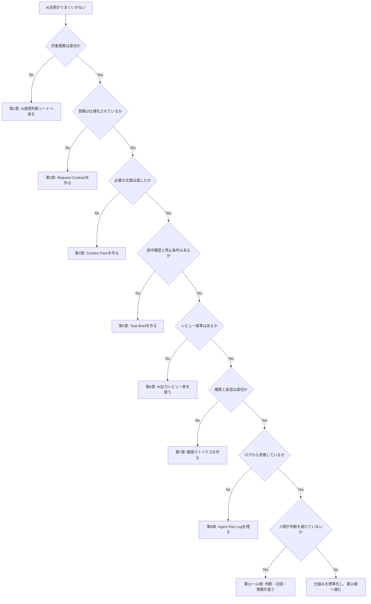

# Troubleshooting Flow: AIエージェント協働で詰まったとき

AI活用がうまくいかない場合、まずプロンプトだけを直さない。原因は、仕事選定、コンテキスト、委任、レビュー、権限、判断のどこかにある。

## 症状別の確認

| 症状 | 主な原因 | 最初に見る章 | 対応 |
|---|---|---|---|
| 出力が浅い | 目的・判断基準が曖昧 | 第3章 | Request Contractを作る |
| 出力が的外れ | Context Pack不足 | 第4章 | 背景、制約、未決事項を追加する |
| 出力が長すぎる | 出力形式が未指定 | 第3章 | 列、章立て、文字数、粒度を指定する |
| もっともらしいが誤りがある | レビュー観点不足 | 第6章 | 事実、根拠、不確実性を分ける |
| AIが勝手に判断する | 人間判断条件が未定義 | 第5章、第11章 | AIに任せない判断を明記する |
| ツール実行が危険 | 権限設計不足 | 第7章、第9章 | read-only / draft-only から始める |
| チームで使われない | 成果物が業務フローに入っていない | 第16章 | テンプレート、レビュー、KPIをセットにする |
| 実験が増えない | 失敗回避、承認過多 | 第13章、第14章 | 小実験とやめる条件を決める |
| 対立が深まる | AIを正論補強に使っている | 第12章 | 論点整理と直接対話を分ける |

## 問題切り分けフロー

Mermaidソース（編集元）

## 最初にやる修正

1. AIへの依頼を3行からRequest Contractへ変える。
2. 資料を丸投げせず、Context Packへ圧縮する。
3. AI出力レビュー表で採用・修正・差し戻しを判定する。
4. Agent Run Logに失敗理由を残す。
5. 次回の依頼書・Context Packへ反映する。
